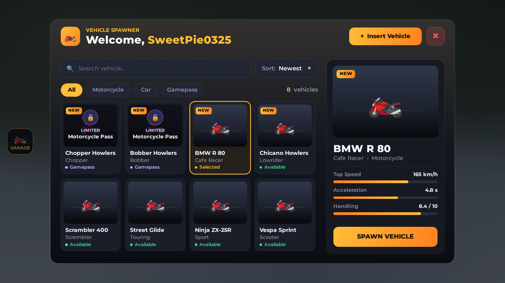
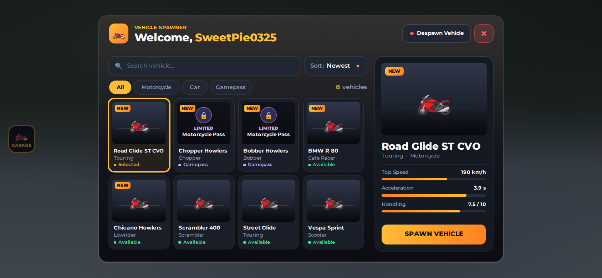
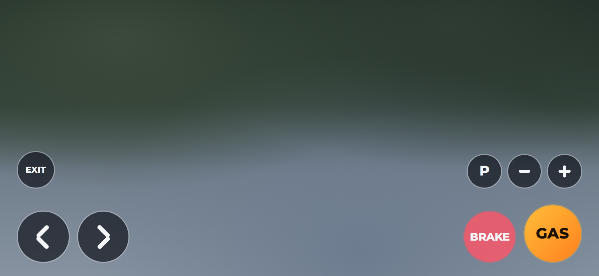
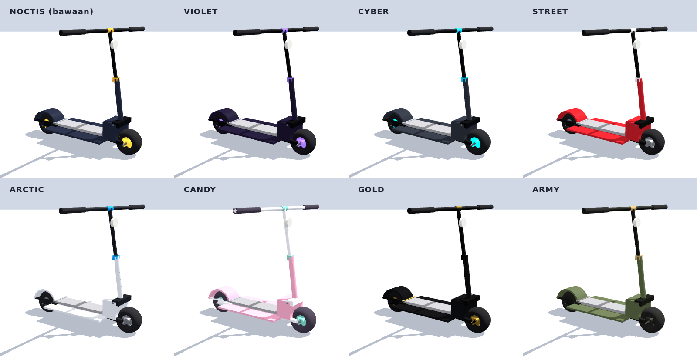
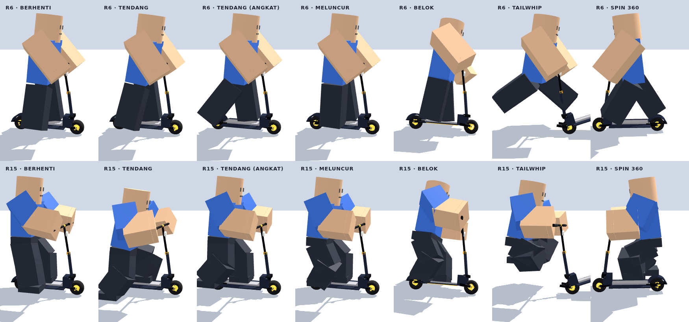
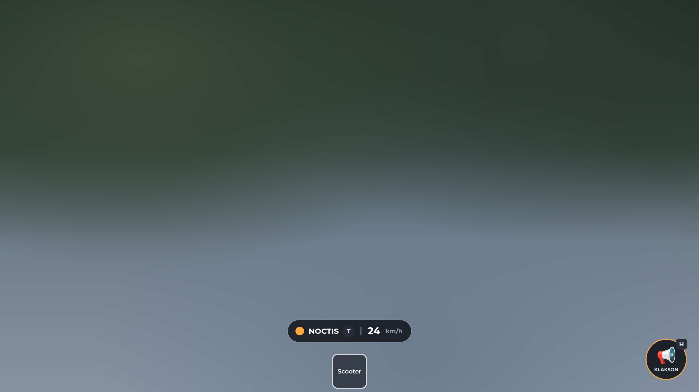
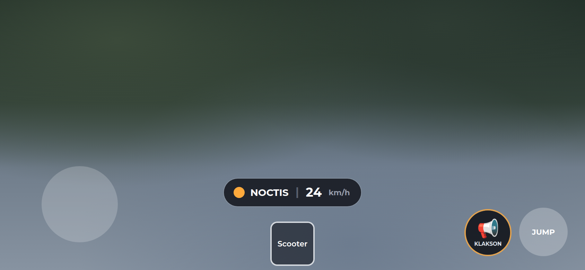
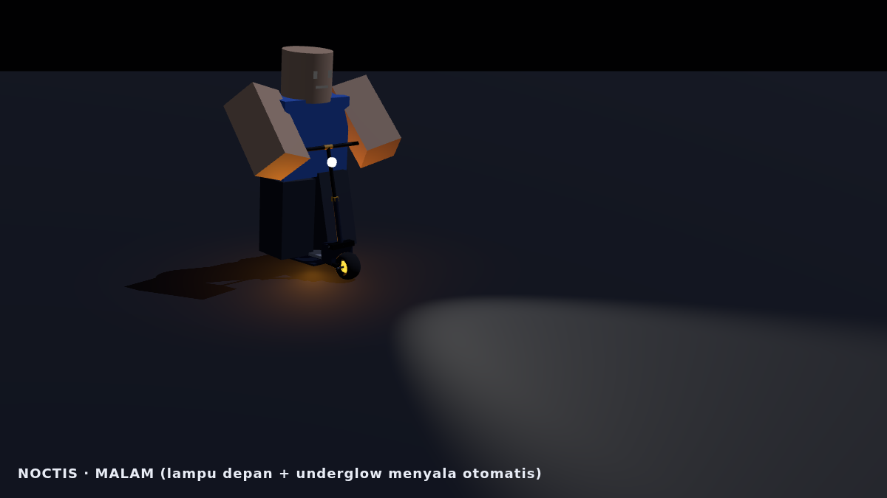

# Vehicle Spawner + HD Road Glide ST CVO + Scooter

Menu spawn kendaraan untuk Roblox (GUI + sistem) plus motor **HD Road Glide ST CVO** yang sudah diperbaiki supaya bisa dikendarai normal di **R6** (juga R15), di PC maupun HP. Ada juga **[Scooter](#scooter-tool)**: tool skuter tendang dengan 8 tema warna, animasi, trik, lampu, dan klakson.



<details>
<summary>Menu di HP dan tombol kontrol motor di HP</summary>



</details>

> Gambar di atas adalah render preview. Di dalam game, kartu dan panel detail menampilkan **model 3D motornya** (panel detail berputar pelan). Ikon 🏍️ hanya muncul kalau modelnya belum ada.

## Cara pasang

Download 4 file ini, lalu di Roblox Studio klik kanan service tujuannya, pilih **Insert from File...**, dan pilih filenya:

| File | Klik kanan di |
|---|---|
| `StarterGui/VehicleSpawnerGui.rbxmx` | **StarterGui** |
| `ReplicatedStorage/VehicleSpawner.rbxmx` | **ReplicatedStorage** |
| `ServerScriptService/VehicleSpawnerServer.rbxmx` | **ServerScriptService** |
| `ServerStorage/Vehicles.rbxm` (berisi motornya) | **ServerStorage** |

Hasilnya:

```
StarterGui/VehicleSpawnerGui            (menu + LocalScript VehicleSpawnerClient)
ReplicatedStorage/VehicleSpawner        (Config, Remotes)
ServerScriptService/VehicleSpawnerServer
ServerStorage/Vehicles/HD Road Glide ST CVO
```

Kalau sebelumnya sudah memasang versi GUI saja, hapus dulu `VehicleSpawnerGui` yang lama. Avatar R6 diatur di **Game Settings → Avatar**.

## Cara main

Buka menu dengan tombol **GARAGE** di kiri layar atau tekan **V**. Pilih kendaraan lalu tekan **SPAWN VEHICLE**. Kendaraan muncul di depan pemain dan pemain langsung duduk di atasnya. **Despawn Vehicle** menghapus kendaraanmu. Setiap pemain hanya punya satu kendaraan; spawn baru otomatis menghapus yang lama.

Untuk naik lagi, dekati motor lalu tekan **E** (muncul tulisan **Drive**; di HP tinggal ketuk). Secara default hanya pemilik yang bisa mengemudi (`OnlyOwnerCanDrive`), dan menabrak jok tidak lagi membuat pemain duduk (`SitByTouch`). Motor tetap **berdiri** saat ditinggal, seperti memakai standar (`KeepUpright`).

**PC**

| Tombol | Fungsi |
|---|---|
| W / S | Gas / rem (tahan S saat berhenti untuk mundur) |
| A / D | Belok |
| Shift kiri | Rem tangan |
| M | Ganti transmisi (Auto → DCT → Manual); E/Q untuk oper gigi di DCT/Manual |
| F | Mesin nyala/mati |
| L, G, J | Lampu, lampu jauh (tahan), lampu kabut |
| Z / C / X | Sein kiri / kanan / hazard |
| H | Klakson |
| Spasi | Turun dari motor |

**HP**: tombol ◀ ▶ untuk belok, **GAS**, **BRAKE**, **P** (rem tangan), **+ / −** (oper gigi, hanya di mode DCT/Manual), dan **EXIT** untuk turun.

## Menambah kendaraan

1. Taruh modelnya di `ServerStorage > Vehicles`.
2. Tambahkan entrinya di `ReplicatedStorage > VehicleSpawner > Config` (`Config.Vehicles`). Isi `Name` sama persis dengan nama modelnya.

Semua pilihan dijelaskan di dalam Config. `GamepassId` dipakai untuk mengunci kendaraan, `Image` untuk gambar kartu, dan `Settings` untuk tombol menu, cooldown, jarak spawn, dan lain-lain.

Config sudah berisi Chopper Howlers, Bobber Howlers, BMW R 80, dan Chicano Howlers dari menu lama. Keempatnya **tersembunyi** sampai modelnya ada di `ServerStorage > Vehicles`. Isi `GamepassId` kedua motor "Limited Motorcycle Pass" dengan ID gamepass-mu.

## Perbaikan pada model motor

Model aslinya punya beberapa masalah yang membuatnya tidak bisa dikendarai normal. Semuanya diperbaiki oleh `tools/patch-road-glide.luau`:

**Supaya bisa dikendarai**
- **Tidak bisa jalan di HP/touchscreen:** script Drive menunggu tombol kontrol sentuh (`Interface.Buttons`) yang tidak ada di model, sehingga loop mesin tidak pernah mulai. Tombol kontrol sentuh sekarang ditambahkan.
- **Transmisi DCT/Manual (harus oper gigi sendiri):** default sekarang **Auto**. Tekan M untuk ganti mode.
- **Mesin harus dinyalakan dengan F dan bisa mati sendiri:** mesin sekarang langsung menyala saat duduk, dan stall dimatikan.

**R6 / badan pengendara**
- Sistem badan pengendara (`FEAnims`) ditulis ulang menjadi `RiderVisuals` di server.
- **Rambut melayang:** aksesori yang dipasang Roblox dengan cara selain `Weld` (misalnya `RigidConstraint`) tidak ikut tersalin, dan yang asli tetap menempel di badan asli yang tak terlihat, yang posisinya lebih tinggi. Aksesori sekarang dikenali lewat joint/constraint apa pun, nama attachment, atau bagian badan terdekat, dan yang asli selalu disembunyikan.
- **Wajah hilang:** kepala sekarang disalin utuh (mesh, wajah, warna), dan aksesori wajah 3D ikut tersalin seperti rambut. Dicek otomatis oleh `tools/test-rider-visuals.luau`.
- Badan, wajah, baju, kaos, paket R6, dan aksesoris selalu kembali normal saat turun, saat motor di-despawn ketika masih dinaiki, atau saat motor terhapus.
- Aksesoris ikut diperkecil sesuai ukuran badan di motor.

**Keamanan**
- **Kill switch dihapus:** `DeleteOnChat` + `Fix` menghapus motor kalau user `rezarezarezarezareza` chat "RG".
- **AutoUpdate dimatikan:** fitur ini bisa mengganti script Drive dengan kode dari aset luar saat game berjalan.
- **Remote lampu, suara, dan animasi:** sebelumnya bisa dipakai pemain mana pun untuk motor siapa pun. Sekarang hanya pengendaranya yang bisa memakainya, dan remote suara hanya menerima suara milik motor itu sendiri.

**Error dan API usang**
- Plugin Kickstand dibuang karena part kickstand-nya tidak ada.
- Script AntiCollide yang memakai API `PhysicsService` usang dibuang. Tabrakan antar kendaraan sekarang diatur spawner lewat collision group.
- Pemberi GUI lampu, klakson, dan remote radio yang error diperbaiki atau dibuang.
- Weld chassis dipindah dari JointsService (usang) ke folder `Welds` di dalam motor.

## Catatan

- Sistem ini belum dicoba langsung di Roblox Studio. Semua script sudah lolos compile Luau dan linter (selene), dan semua path objek yang dipakai script sudah dicek ada di file model. Tetap coba dulu di Studio (Play) sebelum dipublish.
- Statistik di panel detail (Top Speed, dan lain-lain) hanya tampilan dan diisi manual di Config. Performa motor asli diatur di `Tuner` di dalam model motornya.
- Kalau motor muncul menghadap arah yang salah, ubah `SpawnRotation` di Config.

## Scooter (tool)

Skuter tendang "scooter noctis" dijadikan **Tool**. Pemain memilihnya dari hotbar dan langsung naik. Warna, animasi, dan klaksonnya sudah jadi, tanpa perlu upload animasi. Ukurannya menyesuaikan avatar R6 maupun R15.







<details>
<summary>GUI di HP (tombol klakson di samping tombol lompat)</summary>


</details>

<details>
<summary>Malam hari: lampu depan dan underglow menyala otomatis</summary>


</details>

> Gambar skuter di atas adalah render perkiraan. Mesh skuternya adalah aset Roblox yang tidak bisa diunduh di sini, jadi tiap part digambar sebagai bentuk sederhana dengan ukuran, posisi, dan warna yang sama. Warna dan posenya sesuai, tetapi bentuk detailnya di game mengikuti mesh aslinya. Permukaan dek di gambar tampil abu-abu polos; di game dek memakai tekstur aslinya dengan tulisan NOCTIS DISTRICT. Gambar GUI dirender dari GUI yang sama dengan yang dibuat script. Tombol JUMP, thumbstick, dan slot hotbar di gambar hanya tiruan milik Roblox untuk menunjukkan posisinya.

### Cara pasang

| File | Klik kanan di |
|---|---|
| `StarterPack/Scooter.rbxm` | **StarterPack** |
| `StarterPlayerScripts/ScooterAnimator.rbxmx` | **StarterPlayer > StarterPlayerScripts** |

`ScooterAnimator` wajib dipasang. Script ini yang menggerakkan badan pengendara, stang, roda, lampu, dan suara untuk **semua** pemain, jadi setiap pemain bisa melihat animasi pemain lain.

Kalau skuter hanya untuk sebagian pemain (misalnya lewat gamepass atau toko), taruh tool-nya di ServerStorage dan clone ke `Backpack` pemain itu. `ScooterAnimator` tetap dipasang di StarterPlayerScripts.

### Cara main

| PC | HP | Fungsi |
|---|---|---|
| W/A/S/D | Thumbstick | Tahan arah untuk menendang dan menambah kecepatan. Lepas tombol untuk meluncur. Tekan arah berlawanan untuk mengerem. |
| Spasi | Tombol lompat | Lompat. Saat melaju cepat, lompatan jadi trik: **tailwhip** (dek diputar) dan **spin 360** bergantian. |
| H | Tombol **KLAKSON** | Bunyikan klakson. Pemain sendiri langsung mendengar, dan pemain lain di sekitarnya ikut mendengar dari arah skuter. |
| T | Tombol di layar | Ganti warna skuter. Semua pemain melihat warnanya, dan pilihannya diingat sampai pemain keluar. |

Di bawah layar ada speedometer (km/jam) dan tombol ganti warna. Tombol klakson ada di kanan bawah; di HP posisinya di samping kiri tombol lompat supaya tidak saling menutupi. Skuter otomatis disimpan saat pemain duduk (misalnya naik motor dari garasi) atau berenang, dan disembunyikan saat memanjat.

### Tema warna

Ada 8 tema: **Noctis** (bawaan, biru malam + amber, senada dengan menu garasi), **Violet**, **Cyber**, **Street**, **Arctic**, **Candy**, **Gold**, dan **Army**. Semuanya memakai material bawaan Roblox (SmoothPlastic mengilap, Metal, Foil, Rubber untuk ban, Neon untuk velg dan strip bawah dek), jadi tidak ada gambar yang perlu di-upload.

Permukaan dek dengan tulisan **NOCTIS DISTRICT** tidak ikut tema. Teksturnya tetap seperti model aslinya, dan tema hanya mewarnai bagian lain.

Untuk mengatur warna, buka `StarterPack > Scooter > Settings`:

- **Tema bawaan:** ubah `Settings.Theme = "Noctis"` ke nama tema lain.
- **Tema sendiri (misalnya warna map-mu):** salin salah satu tabel di `Settings.Themes`, ganti nama dan warnanya, lalu tambahkan namanya ke `Settings.ThemeOrder`. Keterangan setiap bagian (Paint, Trim, Metal, Accent, Rubber, Rim, Glow, Light) ada di dalam Settings.
- **Satu warna untuk semua pemain:** `Settings.PlayersCanChangeTheme = false`.

### Klakson

Suara klakson memakai ID **95752428333889** (`Settings.HornSound`). Klakson bisa ditekan setiap 0,4 detik (`HornCooldown`) supaya tidak di-spam, dan server menolak klakson yang lebih cepat dari itu.

Kalau tombol klakson ditekan tapi tidak ada suaranya, biasanya penyebabnya izin audio. Roblox hanya memutar audio yang publik atau milik pembuat game. Buka Creator Dashboard, pilih audionya, lalu izinkan untuk game ini di **Permissions**. Setelah itu tes lagi dengan Play.

### Animasi

Semua animasi dihitung oleh script (IK), bukan AnimationTrack, jadi tidak ada ID animasi yang perlu di-upload:

- Kaki kanan menendang tanah saat menambah kecepatan, lalu kedua kaki naik ke dek saat meluncur. Saat berhenti, satu kaki turun ke tanah.
- Tangan selalu memegang handgrip, bahu ikut berputar saat stang belok, dan badan serta skuter condong ke arah belokan.
- Roda berputar sesuai kecepatan, dan badan sedikit mengayun saat mendarat.
- R6 dan R15 didukung (lihat bagian berikut).

### R6 dan R15

- **Ukuran menyesuaikan avatar** (`FitRiderSize`). Skuter diperbesar atau diperkecil sesuai tinggi kaki avatar (0,75× sampai 1,4×). Avatar R15 kecil atau tinggi (Rthro) tetap memegang stang dengan postur yang sama. Tanpa penyesuaian ini, tangan avatar R15 kecil atau tinggi lepas dari stang. R6 selalu berukuran sama, jadi skuternya tetap ukuran normal.
- **Sikap badan R15:** lengan R15 punya siku dan tangannya ada di ujung lengan. Karena itu pengendara R15 berdiri sedikit lebih ke belakang dari stang, dengan kaki depan maju dan lutut agak menekuk. Siku sekitar 60° saat meluncur (rileks, tidak terlipat), dan kaki menapak tanah saat menendang.
- **Sikap badan R6:** kaki dan lengan R6 tidak punya sendi, jadi kaki tetap di bawah pinggul dan tangan memegang stang dengan bagian bawah balok lengan. Tendangannya dibuat lebih lebar (mengayun sekitar −10° sampai 36°) supaya jelas terlihat mendorong, walaupun kaki R6 tidak bisa menyentuh tanah.
- **Performa:** pose badan (bagian paling berat) hanya dihitung untuk pengendara yang terlihat di layar dan dalam jarak 250 stud. Pose skuter milik sendiri selalu dihitung. Roda, stang, lampu, dan suara tetap jalan untuk semua pengendara, dan tabel hasil pose dipakai ulang setiap frame.

### Pengaturan lain (Settings)

| Nama | Bawaan | Fungsi |
|---|---|---|
| `MaxSpeed` | 30 | Kecepatan maksimum (jalan kaki biasa = 16) |
| `StartSpeed` / `Acceleration` | 12 / 9 | Kecepatan tendangan pertama / tambahan per detik |
| `Coast` / `CoastFriction` | true / 8 | Meluncur saat tombol dilepas / seberapa cepat melambat |
| `BrakeForce` | 45 | Kekuatan rem |
| `TurnSpeed` / `TurnSpeedAtMax` | 6 / 3 | Kelincahan belok saat pelan / saat kencang |
| `JumpBoost` | 1.1 | Lompatan 10% lebih tinggi |
| `Tricks` / `TrickMinSpeed` | true / 16 | Trik saat lompat / kecepatan minimum |
| `Lights` | "Auto" | Lampu: "Auto" (malam saja), true, atau false |
| `Sounds`, `RollSound` | true, "" | Suara. Isi `RollSound` dengan ID suara roda dari Toolbox kalau mau |
| `HornSound` / `HornVolume` | ID 95752428333889 / 1 | Suara klakson ("" = tanpa klakson) / volumenya |
| `HornKey` / `HornCooldown` | H / 0.4 | Tombol keyboard klakson / jeda minimum antar klakson (detik) |
| `FitRiderSize` | true | Ukuran skuter mengikuti tinggi avatar |

### Perubahan pada model

`tools/build-scooter.luau` mengubah model asli dengan langkah berikut:

- **Ukuran:** model asli sekitar 2× tinggi karakter. Profilnya diperkecil ke 0,36× sehingga stang berada 2,7 stud di atas dek, pas untuk tangan R6. Hasilnya dek 0,49 stud dari tanah dan roda berdiameter 0,68 stud.
- **Dek:** permukaan dek yang bertekstur (tulisan NOCTIS DISTRICT) diperkecil dengan proporsi yang sama persis dengan aslinya (1,94 × 0,49 stud), jadi tulisannya tidak gepeng atau melar. Alas dek di bawahnya dilebarkan jadi 1,35 stud supaya kedua kaki tetap muat.
- **Nama part:** 40 part diberi nama yang jelas (Deck, Column, Handlebar, GripLeft, Tire, Spoke1 …), dan setiap part diberi atribut `Role` untuk tema.
- **Sambungan:** part dirakit dengan Weld dan Motor6D sehingga stang bisa belok di sumbu tiangnya dan kedua roda bisa berputar. Semua part massless dan tidak bertabrakan, jadi tidak mengganggu gerak karakter.
- **Tambahan:** lampu depan (SpotLight), lampu kolong (PointLight), titik pegangan tangan dan jalur tendangan untuk animasi, RemoteEvent `SetTheme` dan `Horn`, dan modul GUI `ScooterHud`.
- **Tekstur:** tekstur asli dek (NOCTIS DISTRICT) tetap dipakai. Build akan gagal kalau tekstur itu sampai hilang dari file hasil. Part lain yang sebelumnya abu-abu polos diberi warna dan material dari tema.
- **Format file:** file dari Studio versi baru menyimpan Tags dengan format yang belum bisa dibaca Lune. Tags-nya kosong, jadi dibuang saat build (`tools/lib/rbxm.luau`). File hasil build menyimpan `MeshId` sebagai teks biasa, sama seperti yang disimpan Studio.

### Pengujian

`tools/test-scooter-pose.luau` menjalankan simulasi lengkap: berhenti, menendang sampai kecepatan penuh, meluncur, belok kiri, tailwhip, spin 360, lalu meluncur sampai berhenti. Simulasi dijalankan dengan rig R6 standar dan tiga rig R15 (normal, kecil 0,8×, tinggi 1,3×, masing-masing dengan skuter yang ikut diskala), memakai modul `Motion` dan `Pose` yang sama dengan game. Yang dicek:

- Tangan tetap di handgrip. R15 tepat; R6 paling jauh 0,1 stud karena lengannya tidak bisa menekuk.
- Kaki depan tidak melayang atau tenggelam di dek.
- Kaki R15 menyentuh tanah saat menendang.
- Siku R15 rileks saat meluncur (sekitar 62° di ketiga ukuran avatar).
- Stang dan badan condong ke arah belokan, dan roda berputar ke depan.
- Kedua trik terjadi, termasuk kalau data lompatan pemain lain datang terlambat satu frame.

Semua pengecekan ini lolos. Seperti bagian lain di repo ini, skuter **belum dicoba langsung di Roblox Studio**, jadi coba dulu dengan Play sebelum dipublish.

## Build ulang (opsional)

File-file di atas dibuat dari `src/` dan `vehicles/original/` menggunakan [Lune](https://github.com/lune-org/lune):

```sh
lune run tools/build.luau                # GUI, Config/Remotes, script server
lune run tools/patch-road-glide.luau     # motor → ServerStorage/Vehicles.rbxm
lune run tools/build-scooter.luau        # skuter → StarterPack/Scooter.rbxm + StarterPlayerScripts/ScooterAnimator.rbxmx
lune run tools/check.luau                # compile semua script di file model
lune run tools/test-rider-visuals.luau   # tes badan pengendara R6 (kepala, wajah, rambut)
lune run tools/test-scooter-pose.luau    # tes pose pengendara skuter (R6 + R15)
```

Preview PNG: jalankan kedua build dengan `-- --tree`, lalu `node tools/preview/render.cjs` (butuh Playwright dan font Montserrat di `build/fonts`).

Preview skuter: `lune run tools/build-scooter.luau -- --dump`, `lune run tools/test-scooter-pose.luau -- --dump`, lalu `node tools/preview/scooter.cjs` (butuh Playwright dan `three@0.149.0`).
