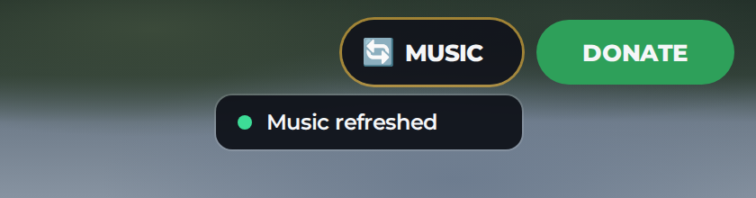

# Vehicle Spawner + HD Road Glide ST CVO

Menu spawn kendaraan untuk Roblox (GUI + sistem) plus motor **HD Road Glide ST CVO** yang sudah diperbaiki supaya bisa dikendarai normal di **R6** (juga R15), di PC maupun HP. Ada juga [tombol **Refresh Musik**](#tombol-refresh-musik) di samping tombol Donate.


<details>
<summary>Menu di HP dan tombol kontrol motor di HP</summary>


</details>

> Gambar di atas adalah render preview. Di dalam game, kartu dan panel detail menampilkan **model 3D motornya** (panel detail berputar pelan). Ikon 🏍️ hanya muncul kalau modelnya belum ada.

## Cara pasang

Download 4 file ini, lalu di Roblox Studio klik kanan service tujuannya, pilih **Insert from File...**, dan pilih filenya:

| File | Klik kanan di |
|---|---|
| `StarterGui/VehicleSpawnerGui.rbxmx` | **StarterGui** |
| `ReplicatedStorage/VehicleSpawner.rbxmx` | **ReplicatedStorage** |
| `ServerScriptService/VehicleSpawnerServer.rbxmx` | **ServerScriptService** |
| `ServerStorage/Vehicles.rbxm` (berisi motornya) | **ServerStorage** |

Hasilnya:

```
StarterGui/VehicleSpawnerGui            (menu + LocalScript VehicleSpawnerClient)
ReplicatedStorage/VehicleSpawner        (Config, Remotes)
ServerScriptService/VehicleSpawnerServer
ServerStorage/Vehicles/HD Road Glide ST CVO
```

Kalau sebelumnya sudah memasang versi GUI saja, hapus dulu `VehicleSpawnerGui` yang lama. Avatar R6 diatur di **Game Settings → Avatar**.

## Cara main

Buka menu dengan tombol **GARAGE** di kiri layar atau tekan **V**. Pilih kendaraan lalu tekan **SPAWN VEHICLE**. Kendaraan muncul di depan pemain dan pemain langsung duduk di atasnya. **Despawn Vehicle** menghapus kendaraanmu. Setiap pemain hanya punya satu kendaraan; spawn baru otomatis menghapus yang lama.

Untuk naik lagi, dekati motor lalu tekan **E** (muncul tulisan **Drive**; di HP tinggal ketuk). Secara default hanya pemilik yang bisa mengemudi (`OnlyOwnerCanDrive`), dan menabrak jok tidak lagi membuat pemain duduk (`SitByTouch`). Motor tetap **berdiri** saat ditinggal, seperti memakai standar (`KeepUpright`).

**PC**

| Tombol | Fungsi |
|---|---|
| W / S | Gas / rem (tahan S saat berhenti untuk mundur) |
| A / D | Belok |
| Shift kiri | Rem tangan |
| M | Ganti transmisi (Auto → DCT → Manual); E/Q untuk oper gigi di DCT/Manual |
| F | Mesin nyala/mati |
| L, G, J | Lampu, lampu jauh (tahan), lampu kabut |
| Z / C / X | Sein kiri / kanan / hazard |
| H | Klakson |
| Spasi | Turun dari motor |

**HP**: tombol ◀ ▶ untuk belok, **GAS**, **BRAKE**, **P** (rem tangan), **+ / −** (oper gigi, hanya di mode DCT/Manual), dan **EXIT** untuk turun.

## Menambah kendaraan

1. Taruh modelnya di `ServerStorage > Vehicles`.
2. Tambahkan entrinya di `ReplicatedStorage > VehicleSpawner > Config` (`Config.Vehicles`). Isi `Name` sama persis dengan nama modelnya.

Semua pilihan dijelaskan di dalam Config. `GamepassId` dipakai untuk mengunci kendaraan, `Image` untuk gambar kartu, dan `Settings` untuk tombol menu, cooldown, jarak spawn, dan lain-lain.

Config sudah berisi Chopper Howlers, Bobber Howlers, BMW R 80, dan Chicano Howlers dari menu lama. Keempatnya **tersembunyi** sampai modelnya ada di `ServerStorage > Vehicles`. Isi `GamepassId` kedua motor "Limited Motorcycle Pass" dengan ID gamepass-mu.

## Tombol Refresh Musik



Tombol **🔄 MUSIC** untuk pemain yang musiknya ngebug (tidak bunyi, macet, atau dobel). Tombol ini otomatis menempel di **sebelah kiri tombol Donate** di pojok kanan atas, dengan tinggi yang sama.

**Cara pasang:** download `StarterGui/MusicRefreshGui.rbxmx`, lalu di Roblox Studio klik kanan **StarterGui**, pilih **Insert from File...**, dan pilih filenya. Tidak perlu script server, dan sistem musik yang sudah ada tidak perlu diubah.

Saat tombol ditekan:

- Lagu yang sedang diputar dimuat ulang lalu dilanjutkan dari detik yang sama.
- Kalau lagu yang sama berbunyi dua kali (dobel), satu dihentikan.
- Kalau tidak ada musik yang berbunyi sama sekali, musik diputar lagi (lanjut ke lagu berikutnya setelah selesai), lalu berhenti sendiri begitu musik dari game-mu jalan lagi.

Semua ini hanya berlaku untuk pemain yang menekan tombol. Pemain lain tidak terpengaruh.

Musik dicari otomatis di Workspace, SoundService, PlayerGui, dan PlayerScripts. Yang dianggap musik: Sound yang namanya atau nama foldernya mengandung *music, musik, song, lagu, bgm, radio, playlist,* atau *soundtrack*, dan Sound 2D (tidak di dalam Part) yang Looped atau panjangnya minimal 20 detik. Suara motor, karakter, dan efek pendek tidak ikut.

Pengaturannya ada di bagian atas LocalScript `MusicRefreshGui > MusicRefreshClient` (`Settings`):

| Pengaturan | Fungsi |
|---|---|
| `DonateButtonName` | Nama tombol Donate, kalau tombolnya tidak ketemu otomatis. Tanpa ini, yang dicari adalah tombol di kanan atas yang bertuliskan "Donate"/"Donasi" (di nama, teks, atau label di dalamnya). |
| `Side`, `Gap` | Letak tombol terhadap tombol Donate: kiri (`"Left"`), kanan (`"Right"`), atau bawah (`"Below"`), dan jaraknya dalam pixel. |
| `FollowDonateButton` | `false` = tidak menempel ke Donate. Tombol memakai posisi `RefreshButton` yang kamu atur sendiri di Studio. |
| `MusicPaths` | Isi kalau musikmu tidak ketemu, mis. `{ "Workspace.Music", "SoundService.BGM" }`. |
| `PlayWhenSilent` | `false` = jangan memutar musik saat tidak ada musik yang berbunyi. |

Kalau tombol Donate tidak ditemukan, tombol MUSIC tetap muncul di pojok kanan atas.

## Perbaikan pada model motor

Model aslinya punya beberapa masalah yang membuatnya tidak bisa dikendarai normal. Semuanya diperbaiki oleh `tools/patch-road-glide.luau`:

**Supaya bisa dikendarai**
- **Tidak bisa jalan di HP/touchscreen:** script Drive menunggu tombol kontrol sentuh (`Interface.Buttons`) yang tidak ada di model, sehingga loop mesin tidak pernah mulai. Tombol kontrol sentuh sekarang ditambahkan.
- **Transmisi DCT/Manual (harus oper gigi sendiri):** default sekarang **Auto**. Tekan M untuk ganti mode.
- **Mesin harus dinyalakan dengan F dan bisa mati sendiri:** mesin sekarang langsung menyala saat duduk, dan stall dimatikan.

**R6 / badan pengendara**
- Sistem badan pengendara (`FEAnims`) ditulis ulang menjadi `RiderVisuals` di server.
- **Rambut melayang:** aksesori yang dipasang Roblox dengan cara selain `Weld` (misalnya `RigidConstraint`) tidak ikut tersalin, dan yang asli tetap menempel di badan asli yang tak terlihat, yang posisinya lebih tinggi. Aksesori sekarang dikenali lewat joint/constraint apa pun, nama attachment, atau bagian badan terdekat, dan yang asli selalu disembunyikan.
- **Wajah hilang:** kepala sekarang disalin utuh (mesh, wajah, warna), dan aksesori wajah 3D ikut tersalin seperti rambut. Dicek otomatis oleh `tools/test-rider-visuals.luau`.
- Badan, wajah, baju, kaos, paket R6, dan aksesoris selalu kembali normal saat turun, saat motor di-despawn ketika masih dinaiki, atau saat motor terhapus.
- Aksesoris ikut diperkecil sesuai ukuran badan di motor.

**Keamanan**
- **Kill switch dihapus:** `DeleteOnChat` + `Fix` menghapus motor kalau user `rezarezarezarezareza` chat "RG".
- **AutoUpdate dimatikan:** fitur ini bisa mengganti script Drive dengan kode dari aset luar saat game berjalan.
- **Remote lampu, suara, dan animasi:** sebelumnya bisa dipakai pemain mana pun untuk motor siapa pun. Sekarang hanya pengendaranya yang bisa memakainya, dan remote suara hanya menerima suara milik motor itu sendiri.

**Error dan API usang**
- Plugin Kickstand dibuang karena part kickstand-nya tidak ada.
- Script AntiCollide yang memakai API `PhysicsService` usang dibuang. Tabrakan antar kendaraan sekarang diatur spawner lewat collision group.
- Pemberi GUI lampu, klakson, dan remote radio yang error diperbaiki atau dibuang.
- Weld chassis dipindah dari JointsService (usang) ke folder `Welds` di dalam motor.

## Catatan

- Sistem ini belum dicoba langsung di Roblox Studio. Semua script sudah lolos compile Luau dan linter (selene), dan semua path objek yang dipakai script sudah dicek ada di file model. Tetap coba dulu di Studio (Play) sebelum dipublish.
- Tombol refresh musik juga belum dicoba di Studio. Logikanya diuji dengan simulasi (`tools/test-music-refresh.luau`): musik macet, lagu dobel, musik mati, lagu yang diganti game di tengah refresh, dan posisi di samping tombol Donate.
- Statistik di panel detail (Top Speed, dan lain-lain) hanya tampilan dan diisi manual di Config. Performa motor asli diatur di `Tuner` di dalam model motornya.
- Kalau motor muncul menghadap arah yang salah, ubah `SpawnRotation` di Config.

## Build ulang (opsional)

File-file di atas dibuat dari `src/` dan `vehicles/original/` menggunakan [Lune](https://github.com/lune-org/lune):

```sh
lune run tools/build.luau                # GUI, Config/Remotes, script server
lune run tools/patch-road-glide.luau     # motor → ServerStorage/Vehicles.rbxm
lune run tools/check.luau                # compile semua script di file model
lune run tools/test-rider-visuals.luau   # tes badan pengendara R6 (kepala, wajah, rambut)
lune run tools/test-music-refresh.luau   # tes tombol refresh musik
```

Preview PNG: jalankan kedua build dengan `-- --tree`, lalu `node tools/preview/render.cjs` (butuh Playwright dan font Montserrat di `build/fonts`).
