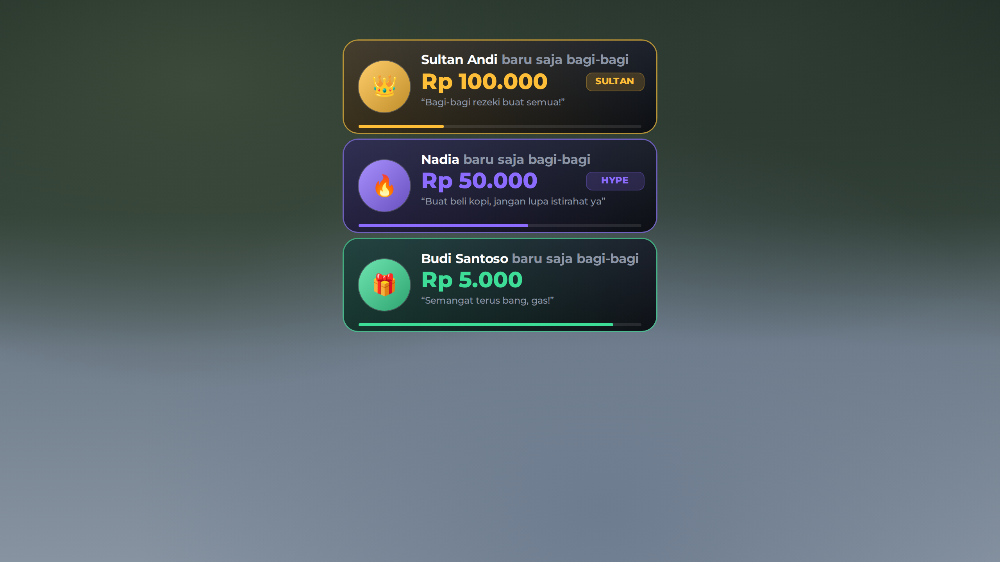
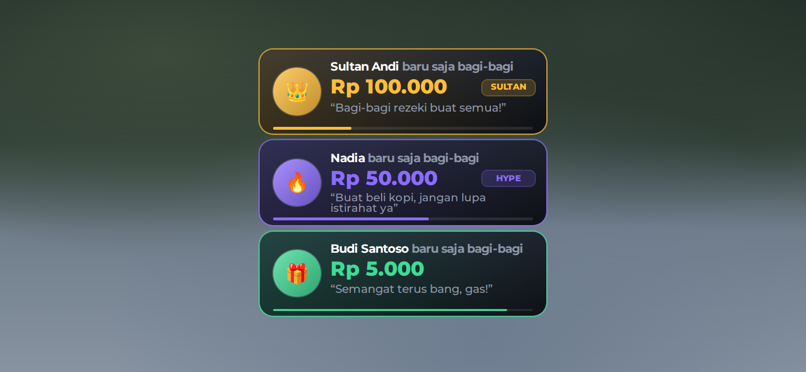

# Vehicle Spawner + HD Road Glide ST CVO

Menu spawn kendaraan untuk Roblox (GUI + sistem) plus motor **HD Road Glide ST CVO** yang sudah diperbaiki supaya bisa dikendarai normal di **R6** (juga R15), di PC maupun HP.


<details>
<summary>Menu di HP dan tombol kontrol motor di HP</summary>


</details>

Repo ini juga berisi **Donate Alerts**, notifikasi donasi ala Saweria / Bagi-Bagi / SocialBuzz ([lihat di bawah](#donate-alerts-notifikasi-donasi)).

> Gambar di atas adalah render preview. Di dalam game, kartu dan panel detail menampilkan **model 3D motornya** (panel detail berputar pelan). Ikon 🏍️ hanya muncul kalau modelnya belum ada.

## Cara pasang

Download 4 file ini, lalu di Roblox Studio klik kanan service tujuannya, pilih **Insert from File...**, dan pilih filenya:

| File | Klik kanan di |
|---|---|
| `StarterGui/VehicleSpawnerGui.rbxmx` | **StarterGui** |
| `ReplicatedStorage/VehicleSpawner.rbxmx` | **ReplicatedStorage** |
| `ServerScriptService/VehicleSpawnerServer.rbxmx` | **ServerScriptService** |
| `ServerStorage/Vehicles.rbxm` (berisi motornya) | **ServerStorage** |

Hasilnya:

```
StarterGui/VehicleSpawnerGui            (menu + LocalScript VehicleSpawnerClient)
ReplicatedStorage/VehicleSpawner        (Config, Remotes)
ServerScriptService/VehicleSpawnerServer
ServerStorage/Vehicles/HD Road Glide ST CVO
```

Kalau sebelumnya sudah memasang versi GUI saja, hapus dulu `VehicleSpawnerGui` yang lama. Avatar R6 diatur di **Game Settings → Avatar**.

## Cara main

Buka menu dengan tombol **GARAGE** di kiri layar atau tekan **V**. Pilih kendaraan lalu tekan **SPAWN VEHICLE**. Kendaraan muncul di depan pemain dan pemain langsung duduk di atasnya. **Despawn Vehicle** menghapus kendaraanmu. Setiap pemain hanya punya satu kendaraan; spawn baru otomatis menghapus yang lama.

Untuk naik lagi, dekati motor lalu tekan **E** (muncul tulisan **Drive**; di HP tinggal ketuk). Secara default hanya pemilik yang bisa mengemudi (`OnlyOwnerCanDrive`), dan menabrak jok tidak lagi membuat pemain duduk (`SitByTouch`). Motor tetap **berdiri** saat ditinggal, seperti memakai standar (`KeepUpright`).

**PC**

| Tombol | Fungsi |
|---|---|
| W / S | Gas / rem (tahan S saat berhenti untuk mundur) |
| A / D | Belok |
| Shift kiri | Rem tangan |
| M | Ganti transmisi (Auto → DCT → Manual); E/Q untuk oper gigi di DCT/Manual |
| F | Mesin nyala/mati |
| L, G, J | Lampu, lampu jauh (tahan), lampu kabut |
| Z / C / X | Sein kiri / kanan / hazard |
| H | Klakson |
| Spasi | Turun dari motor |

**HP**: tombol ◀ ▶ untuk belok, **GAS**, **BRAKE**, **P** (rem tangan), **+ / −** (oper gigi, hanya di mode DCT/Manual), dan **EXIT** untuk turun.

## Menambah kendaraan

1. Taruh modelnya di `ServerStorage > Vehicles`.
2. Tambahkan entrinya di `ReplicatedStorage > VehicleSpawner > Config` (`Config.Vehicles`). Isi `Name` sama persis dengan nama modelnya.

Semua pilihan dijelaskan di dalam Config. `GamepassId` dipakai untuk mengunci kendaraan, `Image` untuk gambar kartu, dan `Settings` untuk tombol menu, cooldown, jarak spawn, dan lain-lain.

Config sudah berisi Chopper Howlers, Bobber Howlers, BMW R 80, dan Chicano Howlers dari menu lama. Keempatnya **tersembunyi** sampai modelnya ada di `ServerStorage > Vehicles`. Isi `GamepassId` kedua motor "Limited Motorcycle Pass" dengan ID gamepass-mu.

## Perbaikan pada model motor

Model aslinya punya beberapa masalah yang membuatnya tidak bisa dikendarai normal. Semuanya diperbaiki oleh `tools/patch-road-glide.luau`:

**Supaya bisa dikendarai**
- **Tidak bisa jalan di HP/touchscreen:** script Drive menunggu tombol kontrol sentuh (`Interface.Buttons`) yang tidak ada di model, sehingga loop mesin tidak pernah mulai. Tombol kontrol sentuh sekarang ditambahkan.
- **Transmisi DCT/Manual (harus oper gigi sendiri):** default sekarang **Auto**. Tekan M untuk ganti mode.
- **Mesin harus dinyalakan dengan F dan bisa mati sendiri:** mesin sekarang langsung menyala saat duduk, dan stall dimatikan.

**R6 / badan pengendara**
- Sistem badan pengendara (`FEAnims`) ditulis ulang menjadi `RiderVisuals` di server.
- **Rambut melayang:** aksesori yang dipasang Roblox dengan cara selain `Weld` (misalnya `RigidConstraint`) tidak ikut tersalin, dan yang asli tetap menempel di badan asli yang tak terlihat, yang posisinya lebih tinggi. Aksesori sekarang dikenali lewat joint/constraint apa pun, nama attachment, atau bagian badan terdekat, dan yang asli selalu disembunyikan.
- **Wajah hilang:** kepala sekarang disalin utuh (mesh, wajah, warna), dan aksesori wajah 3D ikut tersalin seperti rambut. Dicek otomatis oleh `tools/test-rider-visuals.luau`.
- Badan, wajah, baju, kaos, paket R6, dan aksesoris selalu kembali normal saat turun, saat motor di-despawn ketika masih dinaiki, atau saat motor terhapus.
- Aksesoris ikut diperkecil sesuai ukuran badan di motor.

**Keamanan**
- **Kill switch dihapus:** `DeleteOnChat` + `Fix` menghapus motor kalau user `rezarezarezarezareza` chat "RG".
- **AutoUpdate dimatikan:** fitur ini bisa mengganti script Drive dengan kode dari aset luar saat game berjalan.
- **Remote lampu, suara, dan animasi:** sebelumnya bisa dipakai pemain mana pun untuk motor siapa pun. Sekarang hanya pengendaranya yang bisa memakainya, dan remote suara hanya menerima suara milik motor itu sendiri.

**Error dan API usang**
- Plugin Kickstand dibuang karena part kickstand-nya tidak ada.
- Script AntiCollide yang memakai API `PhysicsService` usang dibuang. Tabrakan antar kendaraan sekarang diatur spawner lewat collision group.
- Pemberi GUI lampu, klakson, dan remote radio yang error diperbaiki atau dibuang.
- Weld chassis dipindah dari JointsService (usang) ke folder `Welds` di dalam motor.

## Donate Alerts (notifikasi donasi)

Notifikasi donasi yang muncul di layar semua pemain: nama donatur, jumlah (default **Rupiah**), pesan, foto avatar (kalau ada), dan bar hitung mundur. Warna, emoji, label, dan lama tampilnya berbeda per tingkat donasi (Rp 10.000, 50.000, 100.000, 500.000 ke atas). Kalau banyak donasi masuk sekaligus, kartunya mengantre dan tampil bertumpuk.



<details>
<summary>Tampilan di HP</summary>


</details>

### Cara pasang

Sama seperti garasi: klik kanan service tujuan di Roblox Studio, pilih **Insert from File...**.

| File | Klik kanan di |
|---|---|
| `StarterGui/DonateAlertsGui.rbxmx` | **StarterGui** |
| `ReplicatedStorage/DonateAlerts.rbxmx` | **ReplicatedStorage** |
| `ServerScriptService/DonateAlertsServer.rbxmx` | **ServerScriptService** |

```
StarterGui/DonateAlertsGui              (kartu contoh + LocalScript DonateAlertsClient)
ReplicatedStorage/DonateAlerts          (Config, Remotes)
ServerScriptService/DonateAlertsServer  (+ BindableEvent Notify)
```

Coba dulu: jalankan game di Studio, buka chat, lalu ketik `/testdonate 25000 Semangat terus!`. Di game yang sudah dipublish, perintah ini hanya untuk pemilik game dan UserId di `Settings.Admins`.

### Mengirim donasi

**Dari script server lain** (misalnya setelah pembelian Developer Product):

```lua
local notify = game.ServerScriptService.DonateAlertsServer.Notify
notify:Fire({ donor = "Budi", amount = 25000, message = "Semangat!", target = "RuqFi", userId = 1234 })
```

Hanya `amount` yang wajib. `donor` kosong menjadi "Anonim", `target` mengubah teksnya menjadi "Budi bagi-bagi ke RuqFi", dan `userId` mengganti emoji dengan foto avatar.

**Dari backend luar** lewat [Open Cloud Messaging Service](https://create.roblox.com/docs/cloud/reference/features/messaging-service). Game berlangganan topic `Settings.MessagingTopic` (default `DonateAlerts`), jadi cukup publish JSON yang sama ke topic itu:

```sh
curl -X POST "https://apis.roblox.com/messaging-service/v1/universes/UNIVERSE_ID/topics/DonateAlerts" \
  -H "x-api-key: $ROBLOX_API_KEY" -H "Content-Type: application/json" \
  -d '{"message": "{\"donor\":\"Budi\",\"amount\":25000,\"message\":\"Semangat!\"}"}'
```

API key dibuat di Creator Hub dengan izin **Messaging Service → Publish** untuk game-mu.

Roblox tidak bisa menerima webhook langsung, jadi untuk terhubung ke Saweria, Bagi-Bagi, atau SocialBuzz kamu butuh backend kecil sendiri yang menerima kabar donasi dari platform itu lalu memanggil perintah di atas. **Backend itu belum ada di repo ini.** Simpan API key hanya di backend (jangan di dalam game), dan pastikan backend memverifikasi bahwa donasinya benar-benar dibayar sebelum mem-publish, karena siapa pun yang bisa publish ke topic itu bisa memunculkan notifikasi.

### Pengaturan

Semuanya ada di `ReplicatedStorage > DonateAlerts > Config`:

- `Currency`, `CurrencyPosition`, `ThousandsSeparator`: ganti ke `"Robux"`, `"Suffix"`, `","` kalau mau memakai Robux.
- `Headline`, `TargetHeadline`, `AnonymousName`: teks pada kartu.
- `Position`: `TopCenter`, `TopLeft`, `TopRight`, `BottomCenter`, `BottomLeft`, atau `BottomRight`.
- `MaxVisible`, `MaxQueue`, `RushQueueAt`: berapa kartu tampil bersamaan, panjang antrean, dan kapan kartu mulai tampil lebih singkat.
- `Sound`, `Volume`, `SoundEnabled`: suara notifikasi. Ganti dengan `rbxassetid://` milikmu.
- `Tiers`: batas jumlah, emoji, warna, label, lama tampil, dan suara tiap tingkat.
- `FilterText`, `FilterUserId`: nama dan pesan donatur difilter Roblox sebelum tampil ke pemain lain (atas nama pemilik game; untuk game milik grup isi `FilterUserId`).

## Catatan

- Sistem ini belum dicoba langsung di Roblox Studio. Semua script sudah lolos compile Luau dan linter (selene), dan semua path objek yang dipakai script sudah dicek ada di file model. Tetap coba dulu di Studio (Play) sebelum dipublish.
- Donate Alerts juga belum dicoba di Studio (animasi, suara, perintah chat, dan MessagingService belum pernah berjalan). Yang sudah dicek: semua script lolos compile Luau, semua path objek yang dipakai client ada di file model, dan fungsi format rupiah, pemilihan tingkat, serta pembersih teks sudah dites di Lune. Belum dicek dengan selene. Suara bawaan `Sound` hanya contoh, ganti dengan ID audio milikmu.
- Statistik di panel detail (Top Speed, dan lain-lain) hanya tampilan dan diisi manual di Config. Performa motor asli diatur di `Tuner` di dalam model motornya.
- Kalau motor muncul menghadap arah yang salah, ubah `SpawnRotation` di Config.

## Build ulang (opsional)

File-file di atas dibuat dari `src/` dan `vehicles/original/` menggunakan [Lune](https://github.com/lune-org/lune):

```sh
lune run tools/build.luau                # GUI, Config/Remotes, script server (garasi + donate alerts)
lune run tools/patch-road-glide.luau     # motor → ServerStorage/Vehicles.rbxm
lune run tools/check.luau                # compile semua script di file model
lune run tools/test-rider-visuals.luau   # tes badan pengendara R6 (kepala, wajah, rambut)
```

Preview PNG: jalankan kedua build dengan `-- --tree` (Donate Alerts ikut dari `tools/build.luau`), lalu `node tools/preview/render.cjs` (butuh Playwright dan font Montserrat di `build/fonts`).
