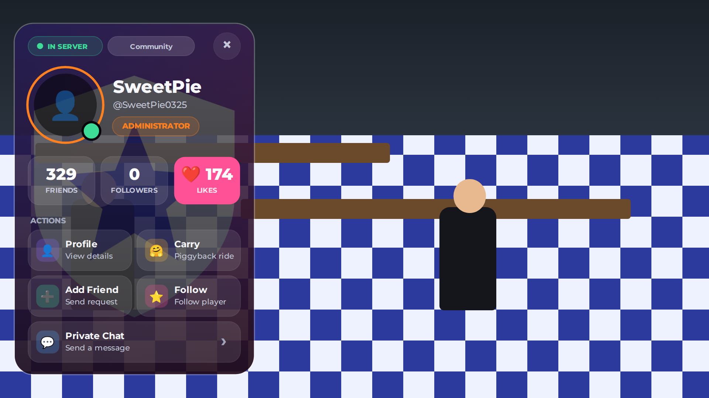
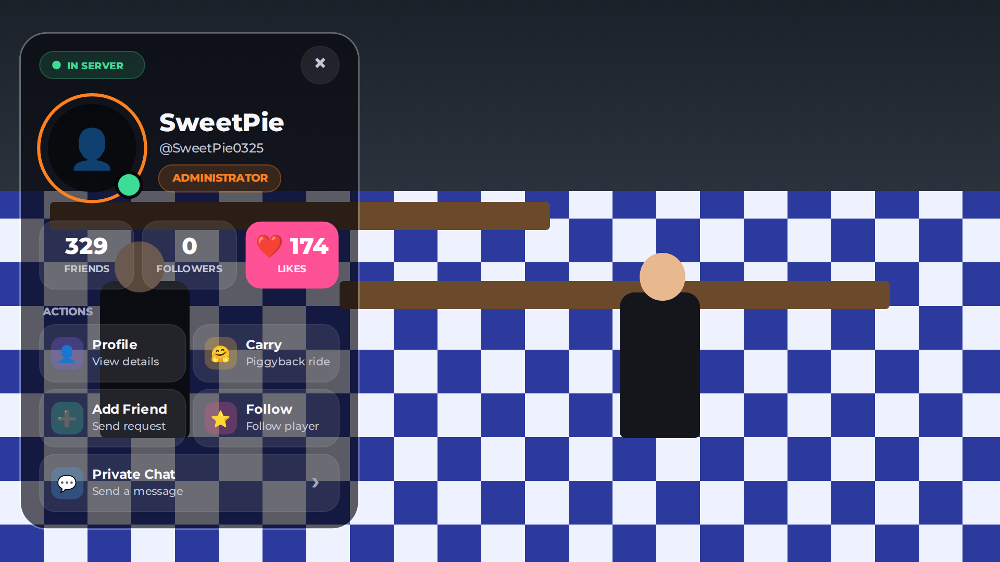
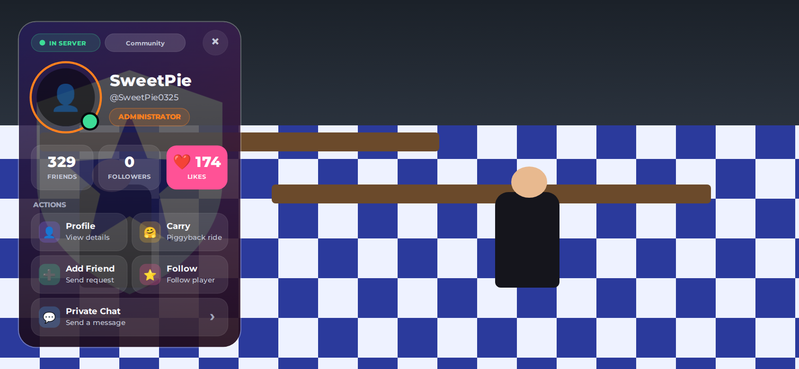
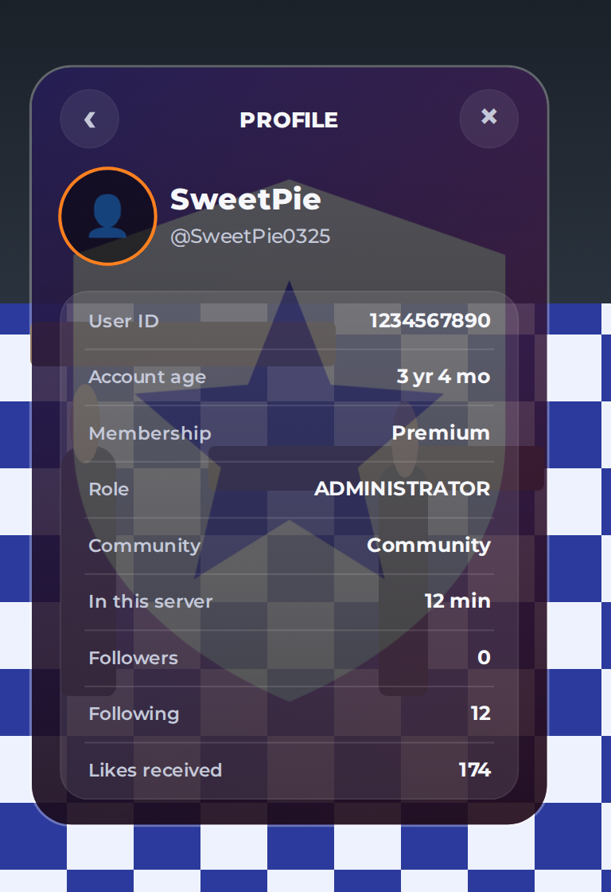
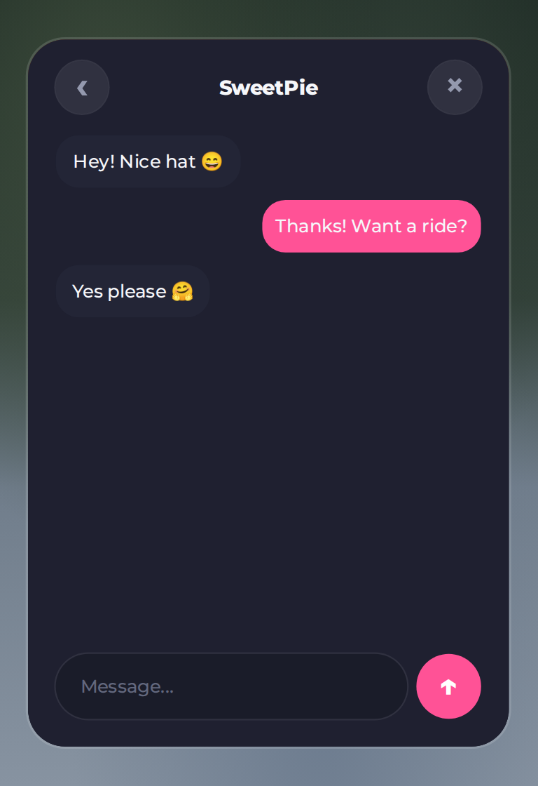
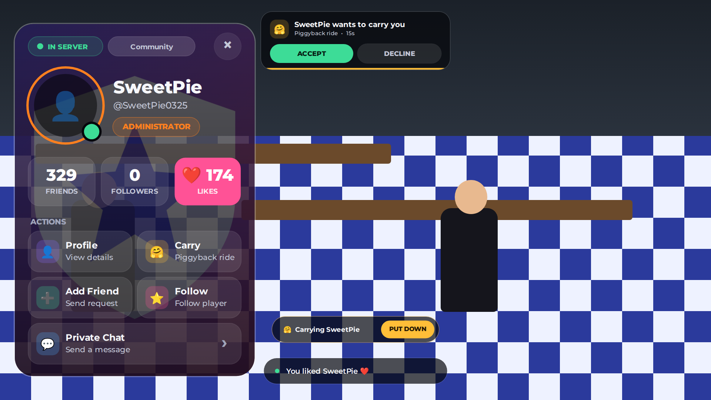
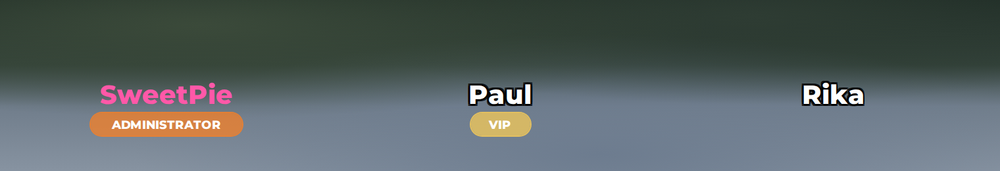

# Vehicle Spawner + Player Menu untuk Roblox

Repo ini berisi dua sistem yang berdiri sendiri:

- **[Vehicle Spawner + HD Road Glide ST CVO](#vehicle-spawner--hd-road-glide-st-cvo)**: menu spawn kendaraan dan motornya.
- **[Player Menu](#player-menu-ketuk-pemain-lain)**: ketuk pemain lain untuk membuka kartu profil (Like, Follow, Carry, Add Friend, Private Chat) plus nametag di atas kepala.

## Vehicle Spawner + HD Road Glide ST CVO

Menu spawn kendaraan untuk Roblox (GUI + sistem) plus motor **HD Road Glide ST CVO** yang sudah diperbaiki supaya bisa dikendarai normal di **R6** (juga R15), di PC maupun HP.


<details>
<summary>Menu di HP dan tombol kontrol motor di HP</summary>


</details>

> Gambar di atas adalah render preview (ikon komunitas di gambar hanya contoh). Di dalam game, kartu dan panel detail menampilkan **model 3D motornya** (panel detail berputar pelan). Ikon 🏍️ hanya muncul kalau modelnya belum ada.

## Cara pasang

Download 4 file ini, lalu di Roblox Studio klik kanan service tujuannya, pilih **Insert from File...**, dan pilih filenya:

| File | Klik kanan di |
|---|---|
| `StarterGui/VehicleSpawnerGui.rbxmx` | **StarterGui** |
| `ReplicatedStorage/VehicleSpawner.rbxmx` | **ReplicatedStorage** |
| `ServerScriptService/VehicleSpawnerServer.rbxmx` | **ServerScriptService** |
| `ServerStorage/Vehicles.rbxm` (berisi motornya) | **ServerStorage** |

Hasilnya:

```
StarterGui/VehicleSpawnerGui            (menu + LocalScript VehicleSpawnerClient)
ReplicatedStorage/VehicleSpawner        (Config, Remotes)
ServerScriptService/VehicleSpawnerServer
ServerStorage/Vehicles/HD Road Glide ST CVO
```

Kalau sebelumnya sudah memasang versi GUI saja, hapus dulu `VehicleSpawnerGui` yang lama. Avatar R6 diatur di **Game Settings → Avatar**.

## Cara main

Buka menu dengan tombol **GARAGE** di kiri layar atau tekan **V**. Pilih kendaraan lalu tekan **SPAWN VEHICLE**. Kendaraan muncul di depan pemain dan pemain langsung duduk di atasnya. **Despawn Vehicle** menghapus kendaraanmu. Setiap pemain hanya punya satu kendaraan; spawn baru otomatis menghapus yang lama.

Untuk naik lagi, dekati motor lalu tekan **E** (muncul tulisan **Drive**; di HP tinggal ketuk). Secara default hanya pemilik yang bisa mengemudi (`OnlyOwnerCanDrive`), dan menabrak jok tidak lagi membuat pemain duduk (`SitByTouch`). Motor tetap **berdiri** saat ditinggal, seperti memakai standar (`KeepUpright`).

**PC**

| Tombol | Fungsi |
|---|---|
| W / S | Gas / rem (tahan S saat berhenti untuk mundur) |
| A / D | Belok |
| Shift kiri | Rem tangan |
| M | Ganti transmisi (Auto → DCT → Manual); E/Q untuk oper gigi di DCT/Manual |
| F | Mesin nyala/mati |
| L, G, J | Lampu, lampu jauh (tahan), lampu kabut |
| Z / C / X | Sein kiri / kanan / hazard |
| H | Klakson |
| Spasi | Turun dari motor |

**HP**: tombol ◀ ▶ untuk belok, **GAS**, **BRAKE**, **P** (rem tangan), **+ / −** (oper gigi, hanya di mode DCT/Manual), dan **EXIT** untuk turun.

## Menambah kendaraan

1. Taruh modelnya di `ServerStorage > Vehicles`.
2. Tambahkan entrinya di `ReplicatedStorage > VehicleSpawner > Config` (`Config.Vehicles`). Isi `Name` sama persis dengan nama modelnya.

Semua pilihan dijelaskan di dalam Config. `GamepassId` dipakai untuk mengunci kendaraan, `Image` untuk gambar kartu, dan `Settings` untuk tombol menu, cooldown, jarak spawn, dan lain-lain.

Config sudah berisi Chopper Howlers, Bobber Howlers, BMW R 80, dan Chicano Howlers dari menu lama. Keempatnya **tersembunyi** sampai modelnya ada di `ServerStorage > Vehicles`. Isi `GamepassId` kedua motor "Limited Motorcycle Pass" dengan ID gamepass-mu.

## Perbaikan pada model motor

Model aslinya punya beberapa masalah yang membuatnya tidak bisa dikendarai normal. Semuanya diperbaiki oleh `tools/patch-road-glide.luau`:

**Supaya bisa dikendarai**
- **Tidak bisa jalan di HP/touchscreen:** script Drive menunggu tombol kontrol sentuh (`Interface.Buttons`) yang tidak ada di model, sehingga loop mesin tidak pernah mulai. Tombol kontrol sentuh sekarang ditambahkan.
- **Transmisi DCT/Manual (harus oper gigi sendiri):** default sekarang **Auto**. Tekan M untuk ganti mode.
- **Mesin harus dinyalakan dengan F dan bisa mati sendiri:** mesin sekarang langsung menyala saat duduk, dan stall dimatikan.

**R6 / badan pengendara**
- Sistem badan pengendara (`FEAnims`) ditulis ulang menjadi `RiderVisuals` di server.
- **Rambut melayang:** aksesori yang dipasang Roblox dengan cara selain `Weld` (misalnya `RigidConstraint`) tidak ikut tersalin, dan yang asli tetap menempel di badan asli yang tak terlihat, yang posisinya lebih tinggi. Aksesori sekarang dikenali lewat joint/constraint apa pun, nama attachment, atau bagian badan terdekat, dan yang asli selalu disembunyikan.
- **Wajah hilang:** kepala sekarang disalin utuh (mesh, wajah, warna), dan aksesori wajah 3D ikut tersalin seperti rambut. Dicek otomatis oleh `tools/test-rider-visuals.luau`.
- Badan, wajah, baju, kaos, paket R6, dan aksesoris selalu kembali normal saat turun, saat motor di-despawn ketika masih dinaiki, atau saat motor terhapus.
- Aksesoris ikut diperkecil sesuai ukuran badan di motor.

**Keamanan**
- **Kill switch dihapus:** `DeleteOnChat` + `Fix` menghapus motor kalau user `rezarezarezarezareza` chat "RG".
- **AutoUpdate dimatikan:** fitur ini bisa mengganti script Drive dengan kode dari aset luar saat game berjalan.
- **Remote lampu, suara, dan animasi:** sebelumnya bisa dipakai pemain mana pun untuk motor siapa pun. Sekarang hanya pengendaranya yang bisa memakainya, dan remote suara hanya menerima suara milik motor itu sendiri.

**Error dan API usang**
- Plugin Kickstand dibuang karena part kickstand-nya tidak ada.
- Script AntiCollide yang memakai API `PhysicsService` usang dibuang. Tabrakan antar kendaraan sekarang diatur spawner lewat collision group.
- Pemberi GUI lampu, klakson, dan remote radio yang error diperbaiki atau dibuang.
- Weld chassis dipindah dari JointsService (usang) ke folder `Welds` di dalam motor.

## Catatan

- Sistem ini belum dicoba langsung di Roblox Studio. Semua script sudah lolos compile Luau dan linter (selene), dan semua path objek yang dipakai script sudah dicek ada di file model. Tetap coba dulu di Studio (Play) sebelum dipublish.
- Statistik di panel detail (Top Speed, dan lain-lain) hanya tampilan dan diisi manual di Config. Performa motor asli diatur di `Tuner` di dalam model motornya.
- Kalau motor muncul menghadap arah yang salah, ubah `SpawnRotation` di Config.

## Player Menu (ketuk pemain lain)

Klik (PC) atau ketuk (HP) karakter pemain lain, lalu muncul **kartu profilnya** di sisi kiri layar, jadi karakternya tetap kelihatan. Latar kartu **transparan**, dan kalau pemain itu punya **komunitas** (group Roblox), **ikon komunitasnya jadi latar kartu**. Di atas kepala setiap pemain ada **nametag**: nama dan role.



<details>
<summary>Kartu di HP, halaman Profile dan Private Chat, popup, dan nametag</summary>

Pemain tanpa komunitas mendapat kartu transparan polos:








</details>

> Gambar di atas adalah render preview. Di dalam game, lingkaran avatar menampilkan **model 3D pemain** yang bergoyang pelan (headshot dipakai selagi modelnya belum siap).

### Cara pasang

Sama seperti spawner: klik kanan service tujuannya, pilih **Insert from File...**, lalu pilih filenya.

| File | Klik kanan di |
|---|---|
| `StarterGui/PlayerMenuGui.rbxmx` | **StarterGui** |
| `ReplicatedStorage/PlayerMenu.rbxmx` | **ReplicatedStorage** |
| `ServerScriptService/PlayerMenuServer.rbxmx` | **ServerScriptService** |

Hasilnya:

```
StarterGui/PlayerMenuGui                (kartu, popup, NametagTemplate + LocalScript PlayerMenuClient dan PlayerMenuNametags)
ReplicatedStorage/PlayerMenu            (Config, Remotes)
ServerScriptService/PlayerMenuServer
```

Aktifkan **Game Settings → Security → Enable Studio Access to API Services** kalau ingin angka Like dan Follow tersimpan saat testing di Studio. Tanpa itu sistemnya tetap jalan, angkanya hanya tidak tersimpan.

### Cara main

- **Ketuk pemain lain** untuk membuka kartunya. Tombol **×** menutupnya. Ketuk pemain lain lagi untuk berpindah kartu.
- **❤️ Like**: ketuk kotak pink bergambar love untuk memberi like. Angkanya bertambah, hati melayang di atas kepala pemain itu (terlihat semua orang), dan tersimpan. Ada jeda `LikeCooldown` per pemain.
- **Komunitas**: server mengambil komunitas utama pemain (kalau tidak ada, komunitas pertama yang dia ikuti) dan menampilkan ikonnya sebagai latar kartu, dengan nama komunitasnya di chip atas. Isi `Community.PreferGroupId` di Config supaya komunitas game-mu didahulukan kalau pemain ada di sana. Matikan dengan `Community.Enabled = false`.
- **Profile**: ID, umur akun, Premium, role, komunitas, lama di server, dan jumlah Followers, Following, Likes.
- **Carry**: menggendong pemain di punggung. Yang digendong menerima popup **Accept / Decline** dulu (`CarryRequiresConsent`). Yang menggendong menekan **PUT DOWN**; yang digendong bisa turun dengan **lompat** atau tombol **GET DOWN**.
- **Add Friend**: membuka permintaan pertemanan bawaan Roblox.
- **Follow**: mengikuti pemain. Followers dihitung di dalam game ini, bukan followers Roblox.
- **Private Chat**: pesan pribadi antar dua pemain. Teks disaring Roblox untuk penerimanya. Pesan masuk muncul sebagai toast (ketuk untuk membalas) dan titik merah di tombolnya.

Membuka kartu dari script lain (misalnya dari leaderboard):

```lua
gui.OpenPlayer:Fire(player)          -- Player atau UserId
gui.OpenPlayer:Fire(player, "Chat")  -- "Home", "Profile", atau "Chat"
```

### Role dan nametag

Edit `ReplicatedStorage > PlayerMenu > Config`:

```lua
Config.Roles = {
    { Name = "ADMINISTRATOR", Color = Color3.fromRGB(255, 128, 31), UserIds = { 123456789 } },
    { Name = "VIP", Color = Color3.fromRGB(255, 208, 84), GamepassId = 987654321 },
}
```

Role juga bisa dari grup (`GroupId` + `MinRank`). Server menyimpan hasilnya di attribute Player (`PMRole`, `PMRoleColor`, ...); script lain boleh mengubahnya kapan saja dan kartu serta nametag ikut berubah. Tampilan nametag ada di `PlayerMenuGui > NametagTemplate`, bebas diubah di Studio.

Semua pilihan lain (jarak, cooldown, carry, chat, nama DataStore, nametag) dijelaskan di dalam Config.

> Player Menu juga belum dicoba langsung di Roblox Studio; yang teruji adalah tes di bagian **Build ulang** (compile, lint, dan simulasi end-to-end). Yang paling perlu dicoba di Studio: posisi yang digendong (`CarryOffset` di Config), bingkai model 3D di lingkaran avatar, dan ketuk karakter di HP.

### Keamanan

Semua yang dikirim tombol dicek ulang di server: target harus ada di server yang sama, cooldown dan jarak dipaksa, Carry butuh persetujuan, chat disaring dan dicek `CanUsersDirectChatAsync`, dan semua remote dibatasi lajunya.

## Build ulang (opsional)

File-file di atas dibuat dari `src/` dan `vehicles/original/` menggunakan [Lune](https://github.com/lune-org/lune):

```sh
lune run tools/build.luau                # GUI, Config/Remotes, script server
lune run tools/patch-road-glide.luau     # motor → ServerStorage/Vehicles.rbxm
lune run tools/check.luau                # compile semua script di file model
lune run tools/test-rider-visuals.luau   # tes badan pengendara R6 (kepala, wajah, rambut)
```

Player Menu dibangun terpisah:

```sh
lune run tools/build-player-menu.luau    # GUI, Config/Remotes, script server
lune run tools/check.luau                # compile semua script di file model
lune run tools/test-player-menu.luau     # tes end-to-end di dunia Roblox tiruan (2 pemain)
```

`test-player-menu` menjalankan script asli hasil build (server, client, nametag) lalu mensimulasikan ketuk pemain, Like, Follow, Carry, Private Chat, role, dan penyimpanan. Ini bukan Roblox, jadi fisika dan tampilan tidak ikut teruji.

Preview PNG: jalankan build dengan `-- --tree`, lalu `node tools/preview/render.cjs` (butuh Playwright dan font Montserrat di `build/fonts`). Tambahkan `playermenu` di belakang perintah untuk merender hanya preview Player Menu.
